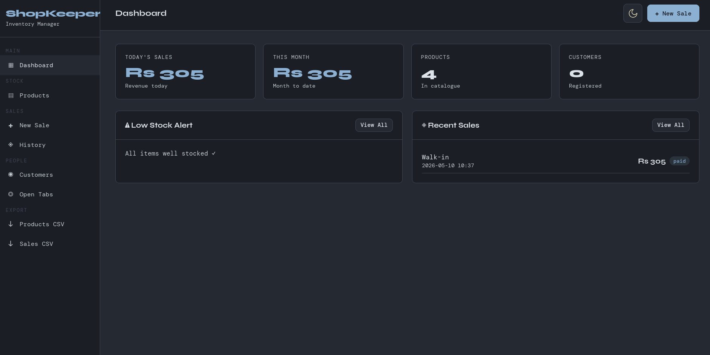
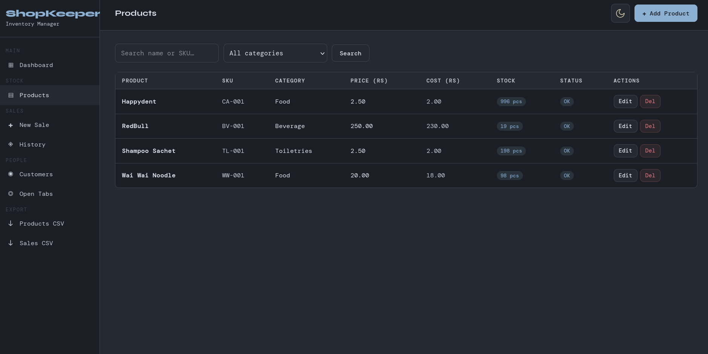
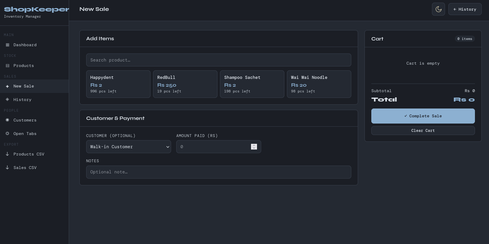
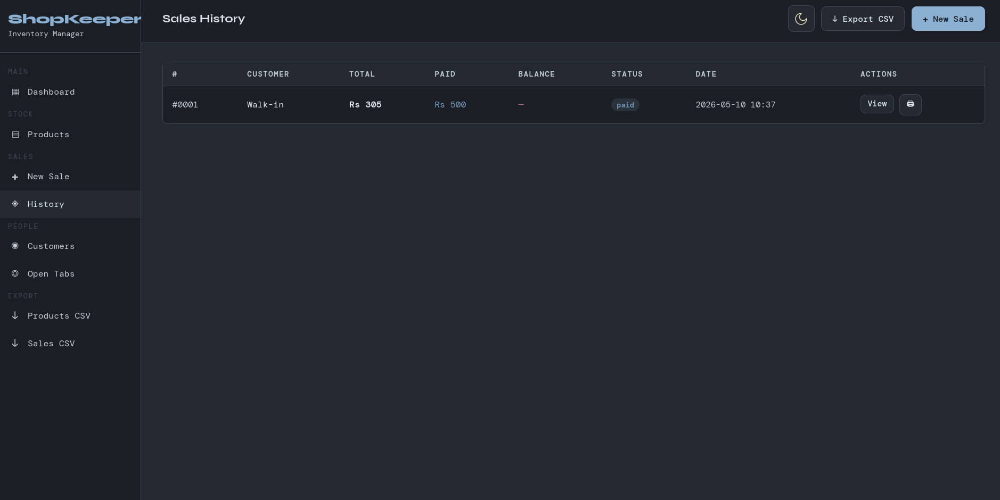
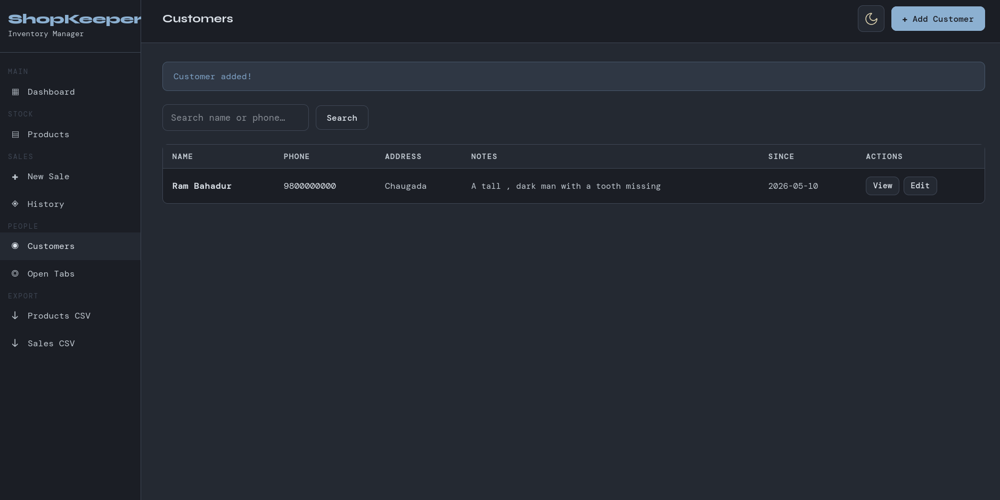
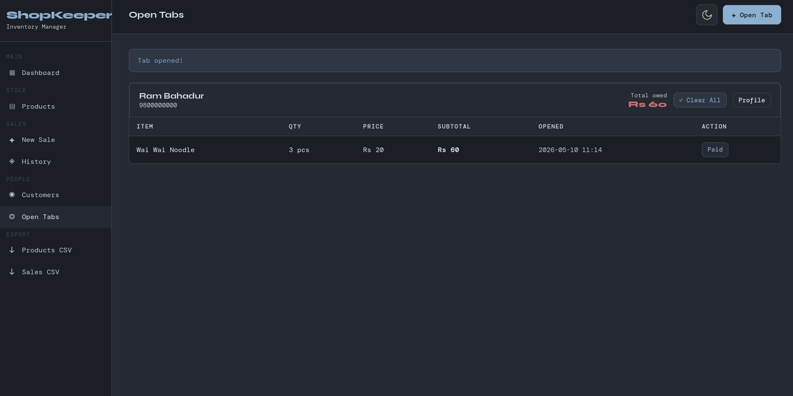

# ShopKeeper — Simple Inventory Manager

A lightweight Flask app for small shops to manage inventory, sales, customers, and open tabs.

## Features

- Product catalogue with low-stock alerts
- POS-style new sale screen (cart, customer picker, change calculator)
- Bill generation & printing
- Sales history
- Customer tracking (purchase history per customer)
- Open tabs (items taken on credit, per customer)
- CSV export (products, sales)
- SQLite — no database setup needed

## Setup

```bash
cd shopkeeper
pip install -r requirements.txt
python app.py
```

Then open: http://127.0.0.1:5000

## Project Structure

```
shopkeeper/
├── app.py              # All routes + DB logic
├── requirements.txt
├── shop.db             # Auto-created on first run
└── templates/
    ├── base.html       # Layout + sidebar
    ├── dashboard.html
    ├── products.html
    ├── product_form.html
    ├── new_sale.html   # POS screen
    ├── bill.html       # Printable receipt
    ├── sales.html
    ├── sale_detail.html
    ├── customers.html
    ├── customer_form.html
    ├── customer_detail.html
    ├── tabs.html
    └── add_tab.html
```

## Quick Start

1. Add a few products under **Products → Add Product**
2. Add customers under **Customers → Add Customer**
3. Go to **New Sale** to record a sale — pick items, set amount paid
4. Print the bill from the bill screen
5. Use **Open Tabs** to track credit purchases

## Notes

- All data stored in `shop.db` (SQLite, single file — easy to backup)
- Currency: Nepali Rupees (Rs) — change in `bill.html` if needed
- For production use, set `debug=False` in `app.py`

## Screenshots

### Dashboard

Overview of shop statistics and quick access to key metrics.



### Products

Manage inventory with low-stock alerts and product details.



### Point of Sale (POS)

Streamlined sales screen with cart, customer selection, and change calculation.



### Sales History

Track all sales transactions with detailed records.



### Customers

Manage customer information and view purchase history.



### Open Tabs

Track credit purchases and customer outstanding balances.


